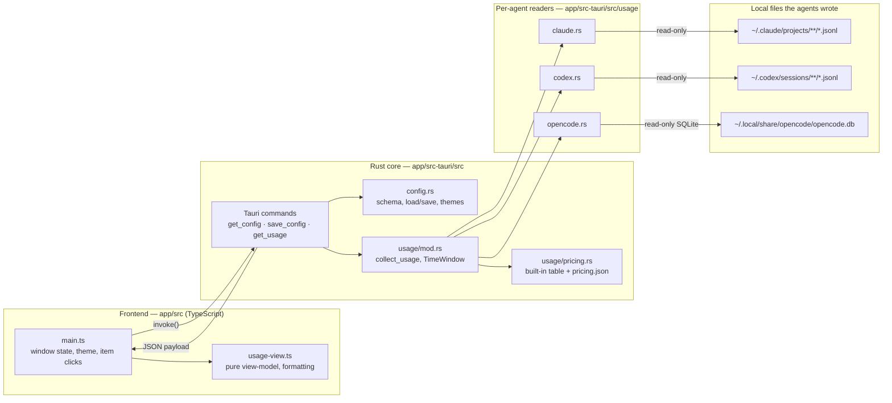

# Architecture

## What this is

orbitbar is a Tauri 2 desktop app: a Rust core plus a TypeScript/HTML
frontend, packaged as one native binary per OS (Windows, macOS, Linux). It
reads token-usage history that Claude Code, Codex CLI and OpenCode already
write to disk, prices it, and renders it in a small always-on-top bar.

## How it fits together



No network edge exists in this diagram on purpose: every read is a local
file, and the frontend only ever talks to the Rust core through Tauri's
`invoke()` IPC — never to the internet.

## Layers

| Layer | Component | Responsibility |
| --- | --- | --- |
| Window/UI | `app/src/main.ts`, `app/src/styles.css`, `app/index.html` | Crescent bar geometry, collapse/expand, drag, theme application, item clicks, panel toggling |
| View-model | `app/src/usage-view.ts` | Pure functions that turn a `UsageSnapshot` into rendered lines — no DOM, unit-testable in isolation |
| Tauri commands | `app/src-tauri/src/lib.rs` | `get_config`, `save_config`, `get_usage`; window placement and autostart reconciliation on launch |
| Config | `app/src-tauri/src/config.rs` | Schema (`AppConfig`), per-OS config dir resolution, load/save, theme palettes, legacy-identifier config migration |
| Usage aggregation | `app/src-tauri/src/usage/mod.rs` | `TimeWindow`, `collect_usage`, project-path normalization, the `UsageSnapshot` shape returned to the frontend |
| Per-agent readers | `app/src-tauri/src/usage/{claude,codex,opencode}.rs` | One reader per agent store, each returning its own `AgentUsageReport` so a broken store never hides the other two |
| Pricing | `app/src-tauri/src/usage/pricing.rs` | Built-in price table (sourced, dated) plus `pricing.json` override loading and cost estimation |

## Data flow: opening the usage panel

1. The frontend calls `invoke("get_usage", { window })` for the selected
   `TimeWindow` (`today` / `last7Days` / `last30Days` / `thisMonth`).
2. `get_usage` (in `lib.rs`) resolves the three store paths under the
   user's home directory, loads `pricing.json` if present, and runs the
   whole read off the main thread (`spawn_blocking`) so a large history
   never stalls the window.
3. `usage::collect_usage` calls each reader — `claude::read_usage`,
   `codex::read_usage`, `opencode::read_usage` — independently. Each
   returns an `AgentUsageReport` with its own `AgentStatus`
   (`Ok` / `NotInstalled` / `Error`), so one broken agent store never hides
   the other two.
4. Claude and Codex totals are priced through `pricing::estimate_cost`
   against the built-in table plus any `pricing.json` overrides; OpenCode
   already carries its own reported cost and skips pricing entirely.
5. The `UsageSnapshot` — window bounds, per-agent totals, per-project
   breakdown, an optional `pricingWarning` — serializes back to the
   frontend, where `usage-view.ts` turns it into the rendered panel.

## Adding a new agent reader

Each reader is self-contained and returns the same shape, so adding one
does not touch the other two:

1. Add `app/src-tauri/src/usage/<agent>.rs` with a
   `pub fn read_usage(root: &Path, start: DateTime<Local>, end: DateTime<Local>, ...) -> AgentUsageReport`,
   returning `AgentUsageReport::not_installed`, `::error`, or `::ok` as
   appropriate — never invent a status.
2. Register it in `usage/mod.rs`: a store-root field on `UsagePaths`, a
   resolution rule in `resolve_paths`, and a call inside `collect_usage`.
3. If the new agent reports cost per session already, skip pricing for it
   the way `opencode.rs` does; if it only reports tokens, price it through
   `pricing::estimate_cost` the way `claude.rs`/`codex.rs` do.
4. Add the agent to `app/src/usage-view.ts`'s types and rendering, and a
   default item (`agent-usage:<agent>`) in `config.rs::default_items` if it
   should get its own cell.

## Adding a custom metric

The same reader/command boundary is the extension point for a metric that
is not token usage: write a new Rust module with its own aggregation
function, expose it as a new `#[tauri::command]` in `lib.rs`, and add a
frontend view-model module (parallel to `usage-view.ts`) that turns the
returned JSON into panel lines. Nothing else in `main.ts` needs to change
beyond wiring the new item's `action` to the new `invoke()` call.

## Cross-platform notes

- Store paths are resolved relative to the home directory (`dirs::home_dir()`)
  the same way on every OS; only the per-user config directory differs
  (`app_config_dir()` from Tauri, which already accounts for the OS
  convention — `%APPDATA%`, `~/.config`, or `~/Library/Application Support`).
- SQLite access uses the bundled `rusqlite` (`features = ["bundled"]`), so
  there is no dependency on a system SQLite binary or DLL on any OS.
- The window is transparent, frameless and always-on-top through Tauri's
  own window flags (`tauri.conf.json`), which map to the native APIs of
  each OS without extra code here.
- Autostart uses `tauri-plugin-autostart`, which registers the appropriate
  OS mechanism (Registry Run key, LaunchAgent, or a `.desktop`/XDG
  autostart entry) per platform; a debug build never registers itself.

## Components in this repo

| Path | Purpose |
| --- | --- |
| `app/src/main.ts` | Window sizing/positioning, theme application, config load/save, item click handling |
| `app/src/usage-view.ts` | Usage panel view-model: formatting, window options, per-agent/per-project rendering |
| `app/src/styles.css` | Bar and panel styling, driven by `--ob-*` custom properties |
| `app/src-tauri/src/lib.rs` | Tauri commands, window placement, autostart reconciliation |
| `app/src-tauri/src/config.rs` | Config schema, load/save, theme palettes, legacy config migration |
| `app/src-tauri/src/usage/mod.rs` | `TimeWindow`, `collect_usage`, `UsageSnapshot`, project-path normalization |
| `app/src-tauri/src/usage/claude.rs` | Claude Code JSONL reader |
| `app/src-tauri/src/usage/codex.rs` | Codex CLI JSONL reader |
| `app/src-tauri/src/usage/opencode.rs` | OpenCode SQLite reader |
| `app/src-tauri/src/usage/pricing.rs` | Built-in price table, `pricing.json` override loading, cost estimation |
| `extensions/` | Optional Herdr/OmniRoute integrations — see [extensions/README.md](../extensions/README.md) |

## History

The product started as a Windows-only PowerShell/WPF prototype
(`legacy/windows-widget/`), which validated the reader-and-panel shape
before the Rust/Tauri rewrite. That prototype is scheduled for removal once
the Tauri app reaches parity on the author's machine; see
`odd/tasks/orbitbar-rebrand.md`.

## Branching

Simple promotion flow, everything converges on `main`:

```
dev ──► staging ──► main
```

- `dev` — active development.
- `staging` — pre-release testing.
- `main` — stable release; all promoted work lives here.
