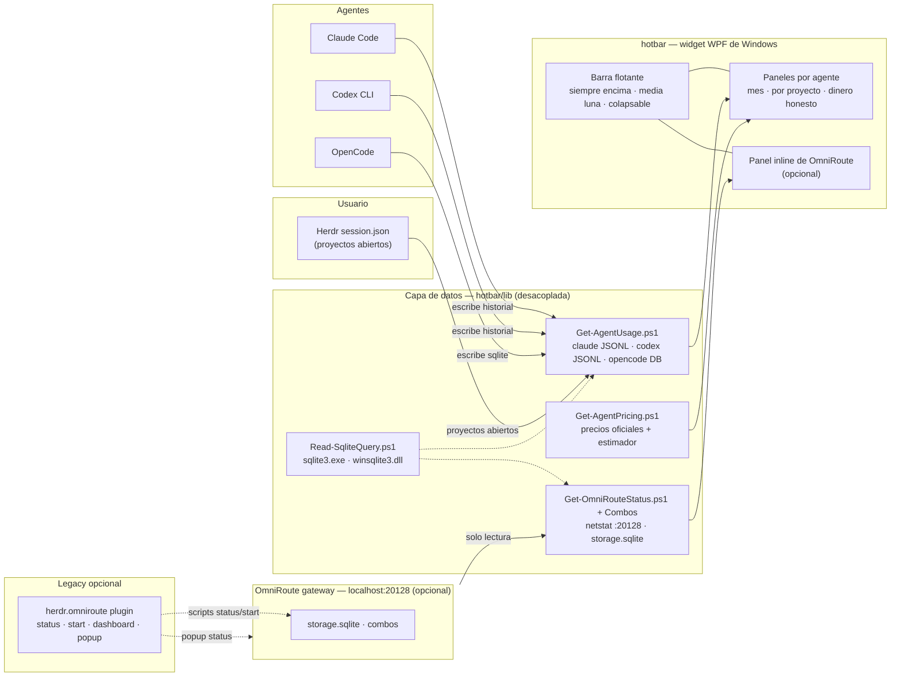

# Architecture — hotbar

## What this is

`hotbar` is a **standalone Windows widget** that turns the data your AI agents
already wrote to disk into a glanceable, honest money readout: per-agent month
totals and per-open-project breakdowns for Claude Code, Codex CLI and OpenCode,
plus an optional inline status panel for the
[OmniRoute](https://github.com/montesgp/omniroute) gateway.

The widget is the product. The OmniRoute gateway surfaces — a Herdr plugin, a pi
extension and a status popup — are older, in-terminal surfaces kept supported as
**legacy optional** extras; none of them is required for the widget to work.

This is **Windows v1**. The runtime is Windows PowerShell 5.1 + WPF. The only
cross-platform advance is architectural: every data source is read through a
small reader layer (`hotbar/lib/*.ps1`) with a common shape, so a future port
replaces readers instead of rewriting the UI.

## Where it mounts



## Layers

| Layer | Component | Responsibility |
| --- | --- | --- |
| 0 — Widget | `hotbar/hotbar.ps1` + `launch-hotbar.ps1` | Floating always-on-top half-moon bar: config-driven cells, collapse/expand, panel per agent, inline OmniRoute panel, single instance, self test |
| 1 — Datos | `hotbar/lib/*.ps1` | Decoupled read-only readers: agent histories, open projects, gateway status/combos, SQLite access; pricing table + estimator |
| 2 — Fuentes | Claude JSONL · codex JSONL · opencode.db · Herdr session.json · OmniRoute storage.sqlite | Files the agents/Herdr/gateway themselves wrote; the widget never modifies them |
| 3 — Legacy opcional | Herdr plugin + pi extension + status popup | The older in-TUI surface around OmniRoute; supported but not required |

Layer 1 is the boundary that makes the widget portable: the widget only knows the
reader shape, never the store format.

## The widget layer

The bar is deliberately **not** a Herdr pane. Three constraints drove that:

- **It must outlive the session.** A pane is opened and closed by Herdr; the bar
  is a desktop fixture that must stay up whether Herdr is running, restored, or
  absent.
- **It must not cost layout space.** `placement = "popup"` reserves nothing while
  closed and borrows the terminal while open. A topmost window costs nothing at
  all and draws over Herdr instead of inside it.
- **It must not depend on a terminal.** The popup is a session modal: it takes
  the whole input stream, so an agent's stray bytes can dismiss it. A WPF window
  has an ordinary event loop and no such coupling.

`hotbar/hotbar.ps1` owns the window; `hotbar/launch-hotbar.ps1` owns the host
concerns (STA apartment, hidden console, second-instance refusal) so the widget
itself only ever has to assume it is already on a pumped STA thread.

### Shape, geometry and the clip

The bar is a half-ellipse `72 x 400` produced by an asymmetric
`CornerRadius="200,0,0,200"`, and the item column is right-aligned and sized
against the curve:

```text
usable width at row y = 72 * sqrt(1 - ((y - 200) / 200)^2)
```

The content spans `dy 68..332`, where that curve leaves 54 px for a 44 px column.
The window keeps its **right** edge pinned to the monitor's working area and
shifts left by the panel width when a panel opens, so the crescent never leaves
the screen — which is why `BarBorder` carries no `Width`.

WPF does **not** clip children to `CornerRadius`, so the `ItemsPanel` gets an
explicit clip in `Update-HotbarBarClip`: a `PathGeometry` (straight right edge +
half-ellipse arc) rebuilt on `SizeChanged` and at window open. Without it, hover
glow and open-panel tabs would draw outside the crescent.

## The data layer

Every read is:

- **Read-only.** Agent histories are appended to by the agents; the widget only
  tails/reads. SQLite opens are `-readonly` (`sqlite3.exe`) or
  `SQLITE_OPEN_READONLY` (`winsqlite3.dll`), and gateway reads are `SELECT`-only.
- **Bounded.** Each agent panel has a byte budget; when the budget is reached the
  panel marks the month as partial (`~`) instead of silently showing a false
  total.
- **Honest.** A failed read renders `sin datos` / `no disponible` — never an
  empty panel, and never a guessed number.
- **Windowless.** External commands (`sqlite3.exe`, `netstat`) run through
  `Invoke-Native.ps1` with `CreateNoWindow`, so no console host flashes.

### Attribution and money rules

- **Per project.** Open projects come from Herdr's `session.json`. Sessions are
  attributed by normalized path prefix: a session under a repo's subdirectory
  counts toward that repo, and buckets below a project path aggregate.
- **Real vs estimated.** OpenCode records real cost; Claude Code and Codex CLI do
  not, so their panels multiply session tokens by the official list price in
  `Get-AgentPricing.ps1` (claude-opus-5-5, gpt-5.6-luna) and mark the result
  `(est)`. A model outside the table renders `sin datos` — unknown is never
  invented.
- **Cache semantics differ per agent.** Claude's `input_tokens` excludes cache, so
  nothing is subtracted and cached tokens price separately; Codex's
  `cached_input_tokens` is a subset of `input_tokens`, so it is subtracted and the
  rest prices as plain input.

### Why personalization lives in the outer layer (anti-breakage contract)

- All runtime configuration stays in **user files**: agent stores under the user
  profile, `%APPDATA%\herdr\session.json`, `~/.omniroute` data, user config.
- This repo never writes into a tool's install directory — not into a vendored
  agent, not into the Herdr binary, not into OmniRoute. Tool updates cannot
  silently overwrite these files.
- If an agent changes its store format, the fix lands in `hotbar/lib`, not in a
  UI rewrite.

## How an agent panel renders

1. `Get-HerdrOpenProjects` reads Herdr's `session.json` (what is open now).
2. `Get-AgentUsage` scans the agent's store for the month, bounded by the panel
   budget, and attributes sessions to projects by path prefix.
3. `Get-AgentPricing` prices tokens where the store has no cost, or reports the
   real cost where it has one.
4. The panel paints the title (`agent~ month`), month totals, one line per open
   project, and the legend lines only when a marker is actually shown.

## Components in this repo

| Path | Purpose |
| --- | --- |
| `hotbar/hotbar.ps1` | The widget: embedded XAML, always-on-top window, half-moon bar + clip, collapse/expand, agent panels, inline gateway panel, single-instance mutex, `-SelfTest` |
| `hotbar/launch-hotbar.ps1` | Host launcher: STA apartment, hidden console, second-instance refusal, `-SelfTest` passthrough |
| `hotbar/config.json` | Items, glyphs (`0xNNNN` code points), labels, tooltips, actions, margin, monitor |
| `hotbar/lib/Invoke-Native.ps1` | Windowless external-command helper (`CreateNoWindow`) |
| `hotbar/lib/Get-AgentUsage.ps1` | Agent store readers (claude/codex JSONL, opencode SQLite), month totals, `Get-HerdrOpenProjects`, path-prefix attribution |
| `hotbar/lib/Get-AgentPricing.ps1` | Official list prices + token→cost estimator; `$null` for unknown models |
| `hotbar/lib/Read-SqliteQuery.ps1` | Read-only SQLite query: `sqlite3.exe` first, P/Invoke over `winsqlite3.dll` as fallback |
| `hotbar/lib/Get-OmniRouteStatus.ps1` | `:20128` listening probe |
| `hotbar/lib/Get-OmniRouteCombos.ps1` | Resolves OmniRoute's `storage.sqlite` and maps the combos table |
| `herdr-plugin.toml` + `scripts/*.ps1` | **Legacy optional:** OmniRoute plugin — 4 workspace actions, 1 popup, no startup hook |
| `extensions/omniroute.ts` | **Legacy optional:** pi extension source (deployed to `~/.pi/agent/extensions/`) |
| `docs/status-panes.md` | Reusable pattern for future status plugins (the legacy popup) |
| `docs/hotbar.md` | Widget guide: config schema, actions, panels, markers, troubleshooting |
| `odd/tasks/hotbar-widget.md` | Widget feature tracker (ODD) — source of truth for this iteration |
| `odd/tasks/omniroute-autofallback.md` | Legacy feature tracker (ODD) — history of the gateway layer |

## Branching

Simple promotion flow, everything converges on `main`:

```
dev ──► staging ──► main
```

- `dev` — active development.
- `staging` — pre-release testing.
- `main` — stable release; all promoted work lives here.